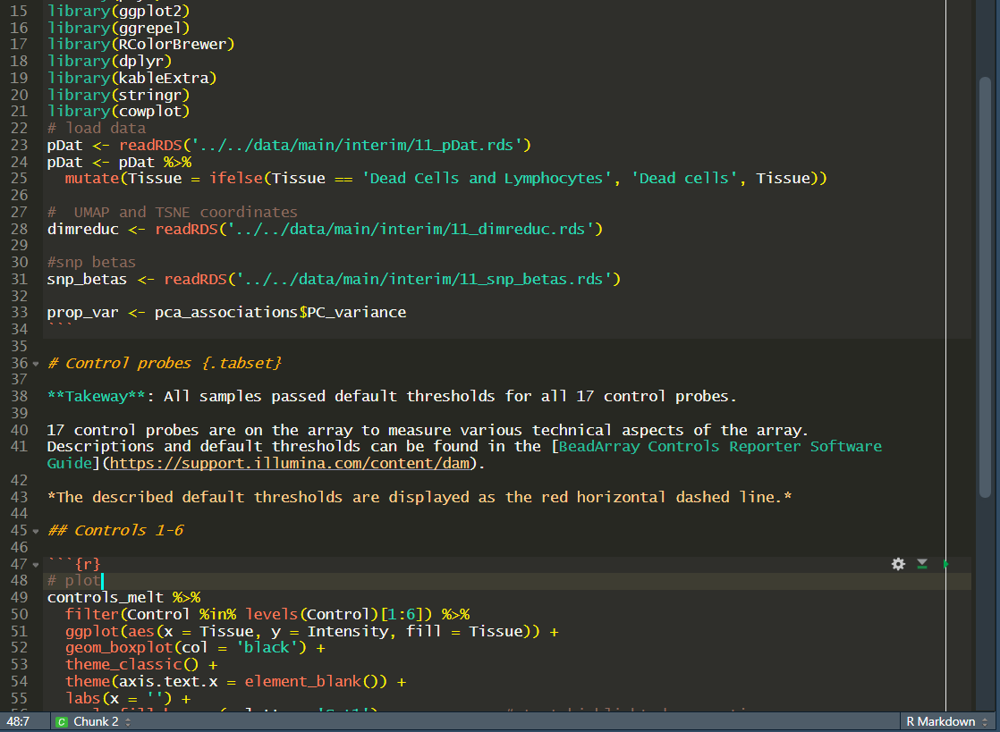

```{r setup, include = FALSE}
knitr::opts_chunk$set(
  collapse = TRUE,
  comment = "#>",
  fig.path = "man/figures/README-",
  out.width = "100%"
)
```

# 49th Parallel

A dark theme inspired by Vancouver's 49th parallel coffee shop.



To install, can run the following

```{r}
rstudioapi::addTheme("https://github.com/wvictor14/rstudio_themes/49th Parallel.rstheme",
                     apply = TRUE)
```